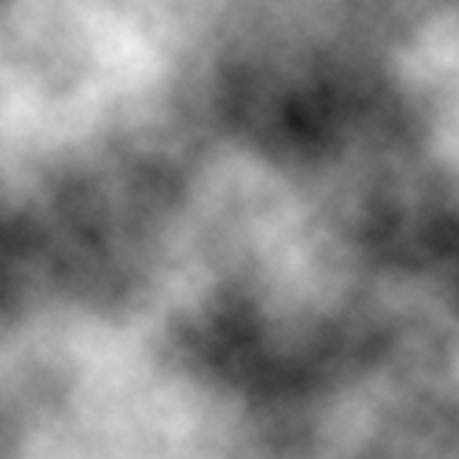
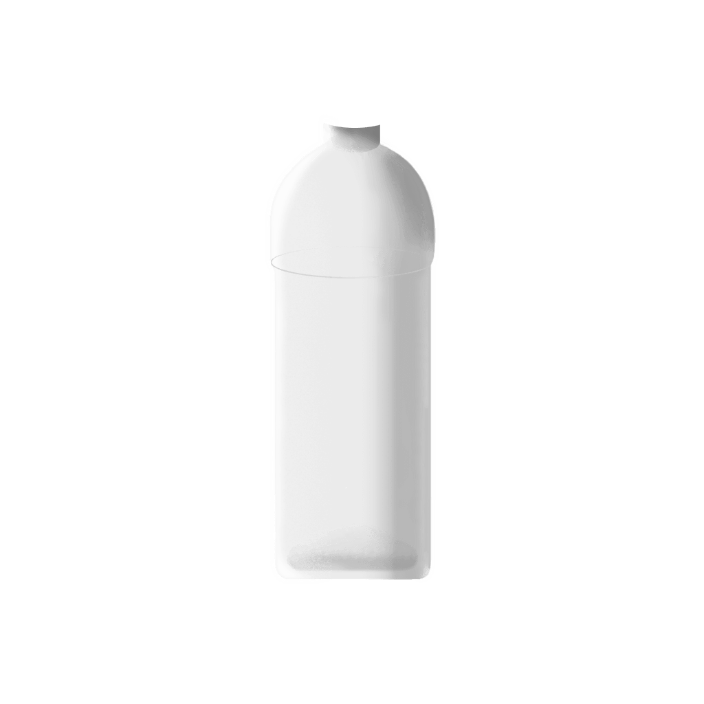

# 一镜到底
## BUG

### [Swiper4](https://www.swiper.com.cn/) Events（事件）

`slideChangeTransitionStart` `slideChangeTransitionEnd` 事件 手机端出现bug：缓慢拖动（滑动）时，事件无法触发。
使用`transitionStart` `transitionEnd` 通过判断`mySwiper.activeIndex`判断当前活动块(激活块)

## 进度控制

####现状：

动画的控制顺序貌似都是通过delay来实现的，由timeline加入到0位置。
####改善：
animation按顺序定义并打上label，每个animation再设置需要插入对应的label
[`.addLabel()`](https://greensock.com/docs/TimelineMax/addLabel()) 

## DisplacementFilter 滤镜
[PIXI.filters.DisplacementFilter](http://pixijs.download/dev/docs/PIXI.filters.DisplacementFilter.html)
利用指定纹理（置换贴图、灰度图）的像素值影响对象object。
Eg.
  1. 置换贴图water-filter
     
     通过移动贴图，形成水波效果。

  2. 置换贴图bottle-filter
     
     模拟透过水瓶的画面效果。